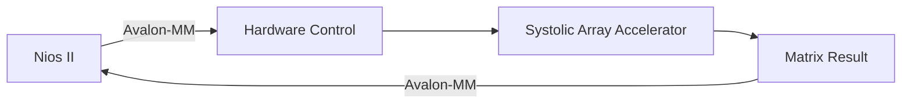

# Systolic Array PE SoC

## 1. Giới thiệu

Đồ án thiết kế và hiện thực **bộ tăng tốc nhân ma trận sử dụng kiến trúc Systolic Array** trên FPGA.

Hệ thống sử dụng các **Processing Element (PE)** để thực hiện tính toán song song, được tích hợp vào hệ thống SoC và điều khiển thông qua **Nios II và giao tiếp Avalon-MM**.

Thiết kế được thực hiện bằng **Verilog HDL** và kiểm tra chức năng bằng **ModelSim**.

---

## 2. Mục tiêu

- Thiết kế Processing Element (PE) cho phép thực hiện các phép tính nhân ma trận.
- Xây dựng kiến trúc Systolic Array để khai thác tính toán song song.
- Hiện thực phép nhân ma trận 4×4.
- Tích hợp bộ tăng tốc phần cứng vào hệ thống SoC.
- Sử dụng Nios II và Avalon-MM để điều khiển phần cứng và trao đổi dữ liệu.
- Mô phỏng và kiểm tra thiết kế bằng ModelSim.

---

## 3. Kiến trúc hệ thống

Kiến trúc tổng thể của hệ thống:

```mermaid


```

Trong đó:

- **Nios II:** thực hiện điều khiển và giao tiếp với phần cứng.
- **Avalon-MM:** giao tiếp giữa bộ xử lý và các khối phần cứng.
- **Matrix IP CORE:** điều khiển quá trình tính toán nhân ma trận.
- **Systolic Array:** thực hiện các phép tính song song.
- **1-PE Non-Systolic:** thực hiện phép nhân chỉ với 1 PE.

---

## 4. Systolic Array

Systolic Array được xây dựng từ nhiều Processing Element (PE) được kết nối với nhau.

```mermaid


```

Các PE thực hiện tính toán theo từng chu kỳ clock và truyền dữ liệu trung gian sang các PE lân cận.

Kiến trúc này cho phép nhiều phép tính được thực hiện song song, phù hợp với việc xây dựng bộ tăng tốc phần cứng trên FPGA.

---

## 5. Processing Element (PE)

Processing Element là đơn vị tính toán cơ bản của Systolic Array.

```mermaid


```

Mỗi PE thực hiện các phép toán cần thiết cho quá trình nhân ma trận, đồng thời truyền dữ liệu và kết quả trung gian sang các PE tiếp theo.

Thiết kế sử dụng các module tính toán **FP16** cho các phép toán số học.

---

## 6. Tích hợp SoC

Bộ tăng tốc Systolic Array được tích hợp vào hệ thống SoC trên FPGA.



Nios II thực hiện việc cấu hình và điều khiển bộ tăng tốc thông qua giao tiếp Avalon-MM.

---

## 7. Mô phỏng và kiểm tra

Thiết kế RTL được mô phỏng bằng **ModelSim**.

Các testbench được sử dụng để kiểm tra:

- Processing Element.
- Systolic Array.
- Phép nhân ma trận.
- Hoạt động của các module tính toán.

Một số testbench chính:

```text
modelsim/
├── tb_systolic.v
├── tb_matrix_mult.v
└── ...
```

Các waveform được sử dụng để quan sát tín hiệu và kiểm tra hoạt động của thiết kế theo từng chu kỳ clock.

---

## 8. Công nghệ sử dụng

| Thành phần | Công nghệ |
|---|---|
| RTL Design | Verilog HDL |
| FPGA | Intel/Altera FPGA |
| SoC Processor | Nios II |
| Bus Interface | Avalon-MM |
| FPGA Development | Quartus Prime / Platform Designer |
| Simulation | ModelSim |
| Arithmetic | FP16 |
| Architecture | Systolic Array |

---

## 9. Cấu trúc repository

```text
Systolic-Array-PE-SoC/
│
├── modelsim/       # Source và testbench cho ModelSim
│
├── software/       # Phần mềm điều khiển trên Nios II
│
├── system/         # Thành phần hệ thống SoC
│
├── *.v             # Các module RTL
├── *.qpf           # Quartus Project
├── *.qsf           # Quartus Settings
├── *.qsys          # Platform Designer System
└── README.md
```


## 10. Kết quả

Đồ án đã xây dựng được một hệ thống tăng tốc nhân ma trận dựa trên kiến trúc Systolic Array, tích hợp vào SoC và được kiểm tra thông qua mô phỏng ModelSim.

- Processing Element (PE)
- Systolic Array
- Matrix Multiplication 4×4
- FP16 Arithmetic
- Nios II
- Avalon-MM
- RTL Simulation với ModelSim
